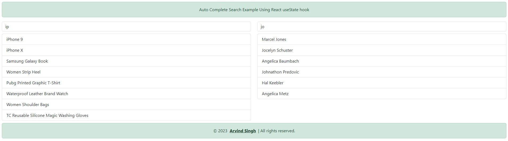
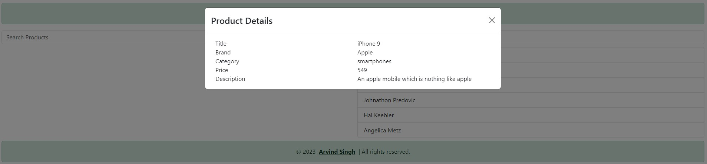
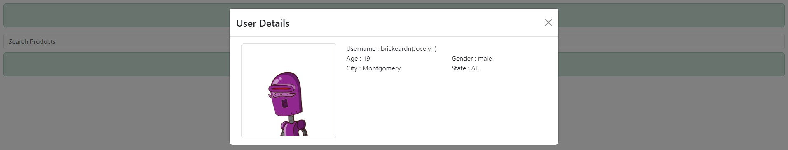

# React Auto-Complete Search using useState Hook
This is a sample application to create reusable auto-complete feature using below react features
* Using Webpacka and Babel for project setup
* React useState Hook
* React Context API
* Created custom hook : useDebounce to avoid multiple API calls on each key press
* Passing props to child component from parent component and vice-versa
* React Bootstarp for UI designing
* ErrorBoundry using react-error-boundary package
* Managing environment variable using dotenv-webpack package

# AutoComplete Search for Products and Users using reusable auto-complete feature

# Display product details for search items using auto-complete search feature

# Display user details for search items using auto-complete search feature
